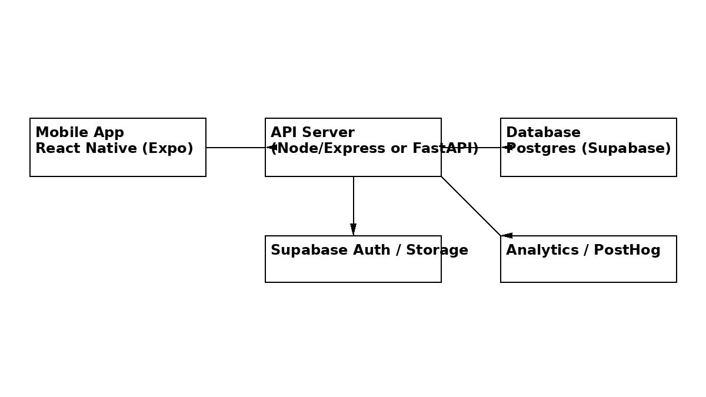

# Golf Improvement App – Product Requirements & Design

## Vision & Problem Statement

Golfers at every level struggle to structure their practice, measure progress across skills and understand where they lose strokes on the course.  Existing apps focus on GPS yardages or post‑round analytics but rarely integrate **structured practice plans**, **evidence‑based fitness**, **strokes‑gained diagnostics** and **WHS handicap tracking** in one workflow.  To help players improve efficiently, this product will provide a unified mobile experience that guides practice sessions, offers a library of drills and fitness exercises, tracks on‑course performance and calculates handicap.  Research shows that dividing range sessions into short‑game, wedge play and full swing segments improves skill retention【284812218788795†L54-L109】, that strength and mobility training can add ≈10 % driving distance while reducing injuries【755215461000871†L32-L41】, and that strokes‑gained analysis pinpoints where players gain or lose strokes relative to a benchmark【524931260664807†L87-L112】.  The app will turn these insights into actionable routines.

## User Personas & Use Cases

| Persona | Description | Key needs |
| --- | --- | --- |
| **Committed amateur** | Plays 2–3 times per week, handicap 8–15, invests in lessons and equipment. | Wants granular stats (FIR, GIR, proximity), strokes‑gained breakdown, personalized drills, and WHS handicap tracking. |
| **Weekend golfer** | Plays 1–2 times per month, handicap 15–25, practices irregularly. | Needs simple practice plans, quick drill guidance, an easy score/handicap tracker and encouragement to practice consistently. |
| **High‑school/college player** | Competitive player focusing on tournament performance. | Requires advanced strokes‑gained analytics, goal tracking, strength/mobility programs, and ability to share data with coach. |

Primary scenarios:

1. **Onboarding** – User enters name, current handicap, goals and practice availability.  The app recommends a starting plan and sets up a schedule.
2. **Log a practice session** – User chooses a drill from the library (e.g., 3‑foot putting ladder), sets reps/timer and records outcomes.  The app provides cues and progressions.
3. **Record a round** – User enters score, fairway/green hits, putts and optional shot information.  The backend computes traditional stats and (optional) strokes‑gained.
4. **View dashboard** – User opens the stats dashboard to see their driving, approach, short‑game and putting performance, trending graphs and handicap index.  Insights highlight strengths and weaknesses.
5. **Plan practice** – Based on stats and goals, the planner suggests weekly sessions balancing skill categories and fitness workouts.  Users can adjust or mark sessions complete.
6. **Manage settings** – Update profile, connect devices (e.g. smart sensor, watch), configure reminders and export data.

## Success Metrics

To ensure the product improves golfers’ performance and engagement, the following metrics will be tracked:

| Metric | Definition | Target |
| --- | --- | --- |
| **Weekly practice adherence** | Percentage of planned practice sessions that users complete. | ≥ 50 % adherence after 4 weeks. |
| **Handicap improvement** | Average change in WHS index over 12 weeks for active users (≥ 6 rounds posted). | Decrease of ≥ 1 stroke. |
| **Strokes‑gained improvement** | Improvement in strokes gained categories for users who enable advanced analytics (OTT/APP/ARG/PUTT). | Gain ≥ 0.5 strokes per round in the weakest category within 8 weeks. |
| **User retention** | Percentage of users who remain active (practice or rounds logged) at 8 weeks. | ≥ 60 %. |
| **NPS / Satisfaction** | Net promoter score from in‑app surveys. | ≥ 40. |
| **Bug‑free CI runs** | Percentage of CI workflows on feature branches that pass on first run. | ≥ 90 %. |

## MVP Scope & Features

### Onboarding & Profile

* Collect name, email (for Supabase auth), age group and experience level.
* Request current handicap (index or estimate), typical practice frequency and goals (e.g. lower handicap, improve short game).
* Offer optional opt‑in for strokes‑gained analytics (requires more round detail).

### Practice Sessions & Drill Library

* Display a **library of drills** categorized into putting, chipping/pitching, full swing/approach, and course management.  Each drill has cues, instructions and difficulty ratings.
* Start a **practice session** by selecting drills; for each drill set reps/time and record results (made/attempted, distance, notes).  Provide a timer/rep counter.
* Save sessions with date, duration, drill details and user notes.  Suggest progressions based on completion.

### Fitness & Mobility Guidance

* Include a set of evidence‑based warm‑ups (cat–cow, world’s greatest stretch, shoulder circles) and strength/mobility workouts derived from University of Utah’s 3‑day program【234290000803937†L93-L137】【234290000803937†L160-L168】.
* Allow users to schedule workouts alongside practice drills.

### Rounds & Stats

* Input hole‑by‑hole score, par, fairway hit, green hit, putts and penalty strokes.  Optionally input shot distances for strokes‑gained.
* Compute traditional metrics: **Driving** (fairways hit %, average distance, miss dispersion), **Approach** (greens in regulation %, proximity, miss pattern), **Short game** (scrambling %, up‑and‑down %, sand save %), **Putting** (make % by distance, 3‑putt avoidance %, average putts).  Support user‑defined targets.
* Provide an **optional strokes‑gained analysis** using the formula `SG = expected strokes – actual strokes – 1`【524931260664807†L87-L102】 with categories OTT/APP/ARG/PUTT【524931260664807†L104-L111】.

### Handicap Tracker

* Calculate a **WHS handicap index** by averaging the **lowest 8 differentials of the most recent 20 rounds**【868834036221733†L88-L114】.  For fewer than 20 rounds, apply the WHS sliding table.  Apply soft/hard caps and exceptional score reductions per WHS rules【868834036221733†L88-L117】.
* Display a **trend chart** of handicap over time and show which scores count toward the current index.  Offer projections (e.g. “post a 78 to lower index to 12.3”).

### Practice Planner & Progression

* Generate a weekly practice schedule based on user goals and weaknesses identified in the stats dashboard (e.g. more putting drills if putting SG is –1.2).
* Support editing and rescheduling sessions.  Mark sessions as complete and log notes.

### Notes & Video Log

* Allow users to capture notes or upload short swing videos tagged to drills.  Store in Supabase storage and link to sessions.

### Settings & Integrations

* Edit profile, update handicap source (manual vs GHIN integration in future), choose measurement units (meters/yard), configure notifications.
* Provide integration hooks for optional external devices (club sensors, smart watches) and export of raw data (CSV).

## Non‑Functional Requirements

* **Cross‑platform app** – Built with React Native (Expo) using TypeScript; responsive layouts for phones and tablets.
* **Server & DB** – Node/Express or FastAPI backend deployed on Supabase/Render with Postgres; Supabase handles authentication and file storage.  Use RLS (row‑level security) to ensure users can only access their data.
* **Analytics** – Capture anonymized usage events via PostHog.  Track feature interactions and funnel metrics (onboarding completion, session logs).
* **Testing & Quality** – Target ≥ 80 % code coverage on critical modules.  Use Jest/React Testing Library on the app, Vitest/Jest on the API, and Playwright for E2E smoke tests.  Use ESLint, Prettier and TypeScript strict mode.
* **CI/CD** – Implement GitHub Actions for linting, testing and building on PRs; automatic versioning and releases on tags; dependabot for dependency updates.

## Key Risks & Mitigations

| Risk | Impact | Mitigation |
| --- | --- | --- |
| **Manual data entry fatigue** | Users may abandon rounds/practice logging due to complexity. | Keep inputs minimal; provide default values; allow quick logging via templates; integrate watch/sensor data in future. |
| **Accuracy of strokes‑gained** | Requires precise distances and shot locations, which amateurs may approximate incorrectly. | Make strokes‑gained optional; provide educational tooltips; allow partial shot logging and use baseline approximations. |
| **Data privacy & compliance** | Sensitive performance data and login credentials must be protected. | Use Supabase authentication, secure storage with RLS, encryption in transit, and opt‑in analytics. |
| **Overwhelming novice users** | Too much data can be confusing. | Use progressive disclosure: start with basic stats and enable advanced analytics when ready; provide in‑app explanations. |
| **Integration complexity** | Adding sensor/wearable integrations increases scope. | Defer to post‑MVP; design modular architecture with adapter pattern for device integration. |

## Wireframes

The following wireframe sketches illustrate the key screens:

1. **Onboarding** – Collect user info, goals and baseline handicap; simple forms with progress steps.
2. **Drill Library** – Searchable list of drills categorized by putting, wedges, full swing and course management.
3. **Practice Session** – Display selected drill, timer/rep counter, input for results and notes.
4. **Stats Dashboard** – Show cards summarizing driving, approach, short game and putting stats; a trend chart for strokes gained and scoring; link to handicap dashboard.
5. **Settings** – Options for profile, practice preferences, notifications, integrations and data export.

**Note**:  See the attached images in this report for the visual wireframes and architecture diagram.

## System Design

### High‑Level Architecture

The mobile app communicates with a backend API hosted on Supabase or another cloud platform.  The API interfaces with a Postgres database for persistent storage and Supabase authentication and file storage.  PostHog collects anonymized analytics.  The architecture diagram shows the main components and data flows.



### Database Schema (Postgres)

The following SQL defines the initial schema for the MVP.  All tables include `id` as a UUID primary key (generated via `gen_random_uuid()`), `created_at` and `updated_at` timestamps.

```sql
-- Enable extensions for UUID generation
CREATE EXTENSION IF NOT EXISTS pgcrypto;

CREATE TABLE users (
  id              UUID PRIMARY KEY DEFAULT gen_random_uuid(),
  email           TEXT NOT NULL UNIQUE,
  password_hash   TEXT NOT NULL,
  name            TEXT,
  handicap        NUMERIC(4,1),
  created_at      TIMESTAMP WITH TIME ZONE DEFAULT now(),
  updated_at      TIMESTAMP WITH TIME ZONE DEFAULT now()
);

CREATE TABLE drills (
  id            UUID PRIMARY KEY DEFAULT gen_random_uuid(),
  category      TEXT NOT NULL CHECK (category IN ('putting','short_game','full_swing','strategy')),
  name          TEXT NOT NULL,
  cues          TEXT,
  difficulty    INTEGER CHECK (difficulty BETWEEN 1 AND 5),
  instructions  TEXT,
  created_at    TIMESTAMP WITH TIME ZONE DEFAULT now(),
  updated_at    TIMESTAMP WITH TIME ZONE DEFAULT now()
);

CREATE TABLE sessions (
  id          UUID PRIMARY KEY DEFAULT gen_random_uuid(),
  user_id     UUID NOT NULL REFERENCES users(id) ON DELETE CASCADE,
  type        TEXT NOT NULL CHECK (type IN ('practice','workout')),
  started_at  TIMESTAMP WITH TIME ZONE NOT NULL,
  duration_min INTEGER,
  notes       TEXT,
  created_at  TIMESTAMP WITH TIME ZONE DEFAULT now(),
  updated_at  TIMESTAMP WITH TIME ZONE DEFAULT now()
);

CREATE TABLE session_items (
  id           UUID PRIMARY KEY DEFAULT gen_random_uuid(),
  session_id   UUID NOT NULL REFERENCES sessions(id) ON DELETE CASCADE,
  drill_id     UUID NOT NULL REFERENCES drills(id),
  params       JSONB,
  result       JSONB,
  created_at   TIMESTAMP WITH TIME ZONE DEFAULT now(),
  updated_at   TIMESTAMP WITH TIME ZONE DEFAULT now()
);

CREATE TABLE rounds (
  id          UUID PRIMARY KEY DEFAULT gen_random_uuid(),
  user_id     UUID NOT NULL REFERENCES users(id) ON DELETE CASCADE,
  date        DATE NOT NULL,
  course      TEXT,
  tees        TEXT,
  scorecard   JSONB NOT NULL, -- array of hole objects {hole, par, score, fairway_hit, green_hit, putts, penalties, shots:[]}
  created_at  TIMESTAMP WITH TIME ZONE DEFAULT now(),
  updated_at  TIMESTAMP WITH TIME ZONE DEFAULT now()
);

CREATE TABLE stats (
  id          UUID PRIMARY KEY DEFAULT gen_random_uuid(),
  user_id     UUID NOT NULL REFERENCES users(id) ON DELETE CASCADE,
  date        DATE NOT NULL,
  category    TEXT NOT NULL,
  metric_key  TEXT NOT NULL,
  metric_value NUMERIC,
  created_at  TIMESTAMP WITH TIME ZONE DEFAULT now()
);

CREATE TABLE handicaps (
  id            UUID PRIMARY KEY DEFAULT gen_random_uuid(),
  user_id       UUID NOT NULL REFERENCES users(id) ON DELETE CASCADE,
  current_index NUMERIC(5,1),
  calc_method   TEXT DEFAULT 'WHS',
  updated_at    TIMESTAMP WITH TIME ZONE DEFAULT now()
);

CREATE TABLE plans (
  id         UUID PRIMARY KEY DEFAULT gen_random_uuid(),
  user_id    UUID NOT NULL REFERENCES users(id) ON DELETE CASCADE,
  week_start DATE NOT NULL,
  structure  JSONB NOT NULL, -- list of planned sessions with type and drills
  created_at TIMESTAMP WITH TIME ZONE DEFAULT now(),
  updated_at TIMESTAMP WITH TIME ZONE DEFAULT now()
);

CREATE TABLE videos (
  id         UUID PRIMARY KEY DEFAULT gen_random_uuid(),
  user_id    UUID NOT NULL REFERENCES users(id) ON DELETE CASCADE,
  url        TEXT NOT NULL,
  tags       TEXT[],
  created_at TIMESTAMP WITH TIME ZONE DEFAULT now()
);
```

### REST API Specification

| Method | Path | Description | Parameters / Body | Response |
| --- | --- | --- | --- | --- |
| **POST** | `/auth/signup` | Create a new user via Supabase auth. | `{ email, password, name, handicap }` | `201` on success or error message. |
| **POST** | `/auth/login` | User login, returns JWT/access token. | `{ email, password }` | `200` with token. |
| **POST** | `/rounds` | Submit a round with hole‑by‑hole data. | JWT header; body: `{ date, course, tees, scorecard }`. | `201` with round ID; triggers stats calculation. |
| **GET** | `/stats/dashboard` | Retrieve aggregated stats for driving, approach, short game, putting, scoring for a user. | JWT header; query param `range` (e.g. `4w` for last 4 weeks). | JSON object with metrics and trend arrays. |
| **GET** | `/stats/strokes-gained` | Return strokes‑gained analysis if the user enabled it. | JWT header; query param `round_id` optional. | JSON with OTT, APP, ARG, PUTT values and baseline comparisons. |
| **GET** | `/handicap` | Get current handicap index and historical trend. | JWT header. | JSON with current index, rounds used in calculation and trend points. |
| **POST** | `/sessions` | Log a practice or workout session. | JWT header; body: `{ type, started_at, duration_min, notes, items: [ { drill_id, params, result } ] }`. | `201` with session ID. |
| **GET** | `/plans` | Retrieve the weekly practice plan. | JWT header; query param `week_start`. | JSON with scheduled sessions. |
| **POST** | `/plans` | Create/update a practice plan. | JWT header; body: `{ week_start, structure }`. | `200` with updated plan. |
| **POST** | `/videos` | Upload a video or note. | JWT header; body includes file upload or reference from Supabase storage; metadata. | `201` with video ID. |

Authentication will use Supabase JWT tokens.  All endpoints require authorization except signup/login.

## Implementation Plan

The project will be built iteratively with feature branches and strict CI checks.  Below is a proposed sequence:

1. **Research & PRD (this stage)** – Summarize best practices and compile requirements.  Deliver PRD, wireframes, architecture, schema and API spec.
2. **Project scaffolding** – Initialize a TypeScript monorepo with `app/` (Expo) and `api/` (Node/Express or FastAPI) directories.  Configure ESLint, Prettier, tsconfig and package scripts.  Add `.env.example` and seed SQL in `supabase/migrations/`.
3. **CI/CD setup** – Add GitHub Action workflows:
   * `ci.yml` to install dependencies, lint, type‑check, run unit tests (`jest` / `vitest`), run E2E smoke tests (`playwright`), and build both app and API.  Upload coverage to Codecov using `CODECOV_TOKEN` secret.
   * `release.yml` triggered on tags (e.g. `v1.0.0`) to build the Expo app (EAS preview) and deploy the backend (Supabase migrations via `supabase db push`).
   * `autofix.yml` triggered by a CI failure on a PR: uses GitHub’s commit suggestion API to generate a fix branch, run tests and push the fix.
4. **Database & seed data** – Implement SQL migrations to create tables.  Seed `drills` and `workouts` with example entries (e.g. 3‑foot putting ladder, 9‑ball drill, tempo swings, hip mobility workout).  Add `scripts/seed.ts` to insert sample data via Supabase client.
5. **Backend API** – Build Express (or FastAPI) endpoints following the spec.  Use Supabase client for authentication and Postgres queries.  Write unit tests with `vitest`/`jest` for handlers (e.g. `rounds.test.ts`, `stats.test.ts`).
6. **Mobile app** – Create navigation structure (React Navigation).  Implement screens: Onboarding (forms with validation), Drill Library (flat list of cards with filters), Practice Session (timer and result forms), Stats Dashboard (charts using Victory or Recharts), Handicap Dashboard.  Use `react-hook-form` for inputs and `react-query` for data fetching.  Write component tests with `@testing-library/react-native`.
7. **Analytics & Planner** – Integrate PostHog to send page/screen events and custom metrics.  Build the practice planner logic on the backend to recommend drills based on stats (e.g. low GIR → more approach drills).  Expose recommendations via `/plans` endpoint and display in the app.
8. **E2E testing** – Use Playwright to script a flow: user signs up, logs a practice session and a round, then views stats and handicap.  Run these tests in CI for smoke coverage.
9. **Documentation** – Maintain `README.md` with setup instructions, environment variables (`SUPABASE_URL`, `SUPABASE_ANON_KEY`, `POSTHOG_KEY`, `CODECOV_TOKEN`), testing guidance and troubleshooting.  Add `CONTRIBUTING.md`, PR template and CODEOWNERS.  Use Conventional Commits for commit messages and enforce branch naming conventions.
10. **Release** – After feature completeness and green CI, tag a release.  The release workflow will build the Expo app and publish to Vercel/web or EAS preview; run DB migrations; update changelog.  Monitor production metrics and gather user feedback for the next iteration.

## CI/CD Details

Below is an example GitHub Actions workflow (`.github/workflows/ci.yml`) that enforces linting, type checking, testing and building for both the app and the API:

```yaml
name: CI
on:
  push:
    branches: ['main', 'feat/**', 'fix/**']
  pull_request:
    branches: ['main']

jobs:
  build:
    runs-on: ubuntu-latest
    env:
      NODE_ENV: test
    steps:
      - uses: actions/checkout@v3
      - uses: actions/setup-node@v3
        with:
          node-version: '18'
      - name: Install dependencies
        run: npm install
      - name: Lint
        run: npm run lint
      - name: Typecheck
        run: npm run typecheck
      - name: Unit tests (app & api)
        run: npm run test:unit -- --coverage
      - name: E2E smoke tests
        run: npm run test:e2e
      - name: Build app
        run: npm run build:app
      - name: Build api
        run: npm run build:api
      - name: Upload coverage
        uses: codecov/codecov-action@v3
        with:
          token: ${{ secrets.CODECOV_TOKEN }}
```

Additional workflows will handle releases and autofixes.  Secrets such as `SUPABASE_URL`, `SUPABASE_ANON_KEY`, `POSTHOG_KEY`, and `CODECOV_TOKEN` must be stored in GitHub Actions secrets.  Dependabot should be configured to check npm packages and GitHub Actions weekly.

## README Snippet

```markdown
# Golf Improvement App

## Overview

This project aims to help golfers of all levels improve by combining structured practice sessions, a drill and workout library, detailed stats (including strokes gained) and WHS handicap tracking.  It is a cross‑platform mobile app built with React Native and a Node/Express API backed by Supabase.

## Getting Started

### Requirements

* Node.js ≥ 18
* npm or Yarn
* Supabase account (for hosting Postgres, auth and storage)

### Setup

1. Clone the repository and install dependencies:

   ```bash
   git clone git@github.com:nishmeh/golf-improvement-app.git
   cd golf-improvement-app
   npm install
   ```

2. Copy `.env.example` to `.env` and fill in your Supabase credentials, PostHog API key and Codecov token.

3. Run database migrations and seed data (via Supabase CLI or `npm run db:seed`).  Ensure the Supabase project has row‑level security enabled.

4. Start the backend:

   ```bash
   npm run dev:api
   ```

5. Start the Expo app:

   ```bash
   npm run dev:app
   ```

6. Run tests:

   ```bash
   npm run test
   ```

For detailed contribution guidelines, see `CONTRIBUTING.md`.
```

## Next Iterations

The MVP will establish core functionality.  Future iterations could include:

* **Wearable & sensor integration** – Sync automatic shot tracking from devices (e.g. Arccos, Apple Watch) to reduce manual input.
* **AI swing analysis** – Use camera/video to identify swing faults and suggest drills.
* **Social & coaching features** – Share progress with friends or coaches, schedule coaching sessions and get feedback.
* **Gamification & challenges** – Weekly challenges, leaderboards and rewards to drive engagement.
* **Course management tools** – Provide yardage books, strategy tips and pre‑round game plans for specific courses.

---

*This document, along with the attached wireframes and architecture diagram, defines the initial product scope and design.  It will evolve as feedback is gathered from users and stakeholders.*
